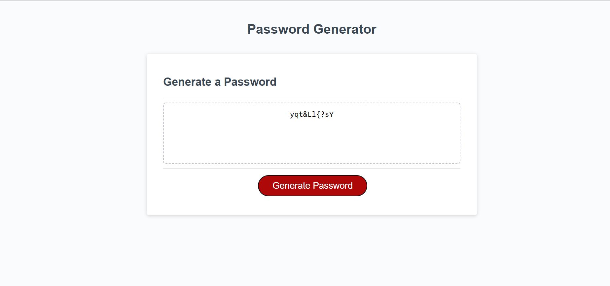

# 
 Secure Password Generator 

## 
 Commentary 

   

Link to deployed site:  https://languagebytes.github.io/Secure-Password-Generator/

The user should be able to formulate their own unique password by answering the questions provided e.g. 'include uppercase?' if yes, uppercase is added, x= x + 1, if no, uppercase is not added, x = x + 0. Their criteria selected will then be turned into a unique password through taking the chosen specifications and randomising them. The password will then be displayed on the page for them to use.
